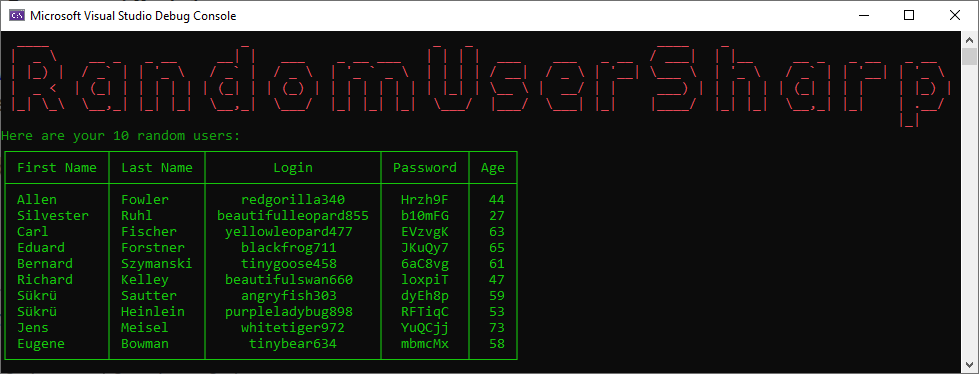

# RandomUserSharp

A .NET client wrapper for http://randomuser.me written in .NET Standard 1.1

## Installation

Install the package via [NuGet](https://www.nuget.org/packages/RandomUserSharp).

<a href="https://www.nuget.org/packages/RandomUserSharp" target="_blank"></a>


## Usage

You can either create a new instance of `RandomUserSharpClient` or if you are using Dependency Injection there is also an interface called `IRandomUserSharpClient` which you can register in your container.

```csharp
Task<List<User>> GetRandomUsersAsync();
```

The `RandomUserSharpClient` provides one method, called `GetRandomUsersAsync`, which has several optional parameters. The following table describes the parameters.

| **name** | **type** | **default value** | **description** |
|-|-|-|-|
| `count` | `int` | `1` | Indicates the amount of random users, which should be generated. |
| `gender` | `Gender` | `Both` | Indicates the gender of the generated persons. |
| `nationalities` | `List<Nationality>` | `null` | Indicates the nationalities of the users. |
| `useLegoImages` | `bool` | `false` | Indicates if the images should be *Lego* images. |
| `seed` | `string` | `null` | Indicates if you want generate the same set of users by using the same `seed`. |
| `passwordOptions` | `PasswordOptions` | `null` | Indicates how the passwords should be generated. |

## Sample

Here is a screenshot of the `Console Application` using the [NuGet package](https://www.nuget.org/packages/RandomUserSharp) to get some random users and display them in a table on the console.



## Buy Me A Coffee

I appreciate any form of support to keep my _Open Source_ activities going.

Whatever you decide, be it reading and sharing my blog posts, using my NuGet packages or buying me a coffee/book, thank you ❤️.

<a href="https://www.buymeacoffee.com/tsjdevapps" target="_blank"></a>

## Contributing

Pull requests are welcome. For major changes, please open an issue first
to discuss what you would like to change.

Please make sure to update tests as appropriate.

## License

[MIT](https://choosealicense.com/licenses/mit/)